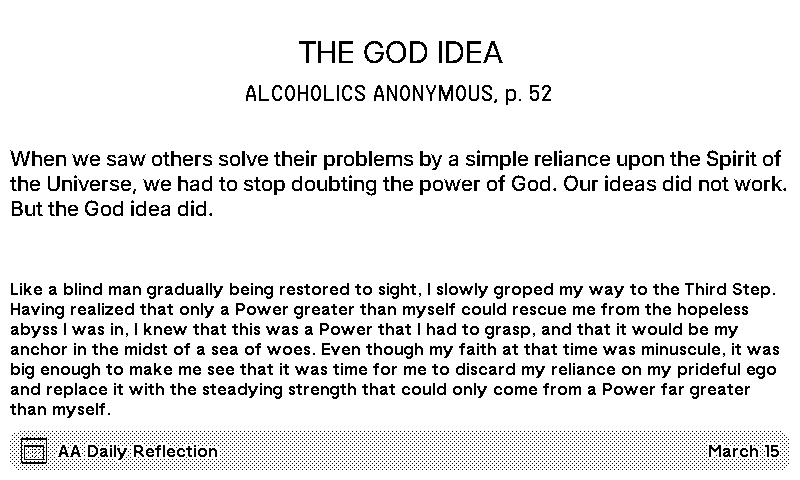

# AA Daily Reflection

AA Daily Reflection - data from https://www.aa.org/daily-reflections

## Intro
This recipe displays today's AA Daily Reflection as listed on the aa.org website. Data is supplied in our GitHub repo to normalize and prevent changes to data format breaking displays.

Day changes happen at Midnight US CHICAGO time (that is the base time of the aa.org website).

## Data Source and Self-Implementation
if you want to implement this yourself (vs using the recipe at https://trmnl.com/plugins)

Set your strategy to POLLING
the Polling URL to: https://raw.githubusercontent.com/jvivona/tidbyt-data/refs/heads/main/aa/dailyreflection.json
paste the appropriate markup code from the html files in this folder
Set your Refresh Rate to 4x daily (just to cover midnight change overs)
