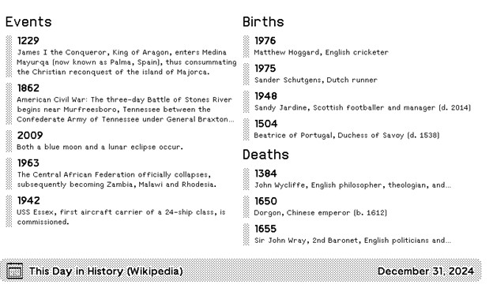

# This Day in History

This Day in History (Wikipedia) plugin for TRMNL

## Intro
This plugin displays random entries from the Wikipedia This Day in History page.  Data is supplied in our GitHub repo.
Random selection of Events, Births & Deaths are randomized every 4 hours

