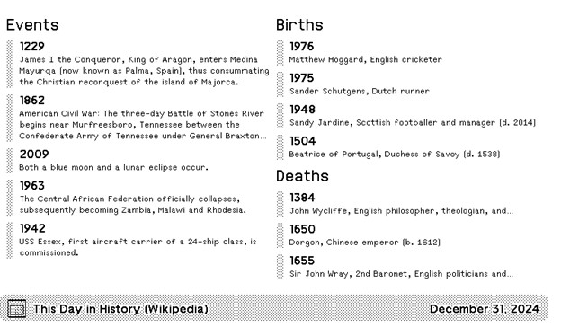

# This Day in History

This Day in History (Wikipedia) plugin for TRMNL

## Intro
This recipe displays random entries from the Wikipedia This Day in History page.  Data is supplied in our GitHub repo.
Random selection of Events, Births & Deaths are changed every 4 hours

Day changes happen at Midnight UTC time.

## Data Source and Self-Implementation
if you want to implement this yourself (vs using the recipie at https://usetrmnl.com/plugins

Set your strategy to POLLING
the Polling URL to: https://raw.githubusercontent.com/jvivona/tidbyt-data/refs/heads/main/thisdayinhistwikipedia/thisdayinhist.json
paste the appropriate markup code from the html files in this folder
Set your Refresh Rate to 4x daily

## Other Languages
Follow the instructions above, except use the template files in the multi-lang directory.  Translations are supplied in the JSON - so there's only 1 set of templates.
URLs for Polling are:
** German: https://raw.githubusercontent.com/jvivona/tidbyt-data/refs/heads/main/thisdayinhistwikipedia/de/thisdayinhist.json
** Spanish: https://raw.githubusercontent.com/jvivona/tidbyt-data/refs/heads/main/thisdayinhistwikipedia/es/thisdayinhist.json
